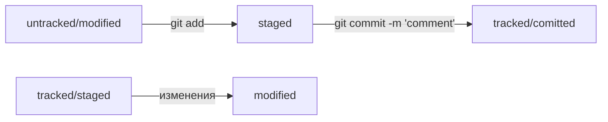

# Практическая работа 1. Делимся проектом с миром
-----
## Добро пожаловать на первую практическую работу с Git
*работа выполнена руками бедного измученного студента*  
-----  

## Подготовительные шаги
1. ~~скачать и установить Git~~ создать директорию для будущего репозитория и с комфортом в ней разместиться
```
mkdir dev/first-practice
cd dev/first-practice/
```


## Работа с локальным репозиторием
1. инициализировать репозиторий
```
git init
```  
1.1. если ветка называется master, то от греха подальше переименовать её на main
```
git branch -m master main
```
2. создать файл [README](https://github.com/vssafronov/first-practice/blob/main/README.md "с этой восхитительной практической работой")
```
touch README.md
```
3. добавить файл README.md (а заодно и все остальные файлы в директории, если есть) в локальный репозиторий
```
git add .
```
4. и закоммитить его с понятным и красивым комментарием
```
git commit -m 'add README.md'
```  


## Работа с удаленным репозиторием
1. зарегистрироваться на GitHub (~~гугл~~ яндекс в помощь)
2. в своём профиле во вкладке [Repositories](https://github.com/vssafronov?tab=repositories) нажать на кнопку "New", ввести Repository name и нажать "Create repository"  
3. связать репозиторий с локальным набором команд из инструкции GitHub 
>…or push an existing repository from the command line
4. Сгенерировать SSH-ключ по [этой](https://practicum.yandex.ru/learn/qa-automation-engineer-java/courses/4bec7a9a-7552-4f4f-9ef3-bfcaabfcaa55/sprints/882571/topics/e942bcd8-542f-4116-b71d-57cdd2d77cdb/lessons/634af282-8529-422d-a257-68ac6a51e8b0/) инструкции и привязать его к GitHub согласно [этой](https://practicum.yandex.ru/learn/qa-automation-engineer-java/courses/4bec7a9a-7552-4f4f-9ef3-bfcaabfcaa55/sprints/882571/topics/e942bcd8-542f-4116-b71d-57cdd2d77cdb/lessons/c8c707cd-b671-4297-b413-24726da654a6/) инструкции  
4.1. если ссылки не открываются, значит они персональные, купите курс и наслаждайтесь  


## Связывание и синхронизация репозиториев
1. открыть свернутый Git Bash и вспомнить что мы находимся в директории репозитория
2. привязать локальный репозиторий к удаленному (url репозитория скопировать с GitHub)
```
git remote add origin git@github.com:vssafronov/first-practice.git
```  
3. придумать текст к этому README и постараться красиво оформить его  
4. запушить изменения на удаленный репозиторий
```
git push
```  
  
    
  
# Практическая работа 2. Дополняем шпаргалку  


## Хеш — идентификатор коммита  

Для того чтобы увидеть хэш коммитов необходимо выполнить команду  
```
git log
```  

символьная строка вида: 
``` 
commit 2ab5714bf6702259a68679b628b18dcad04a0df8
```
и есть хэш коммита  

для отображения сокращенного лога используется команда  
```
git log --oneline
```  
где будут отображаться только первые несколько символов хэша (ровно столько, сколько нужно для уникальности внутри репозитория) и комментарии коммитов.  


## HEAD  

Файл HEAD указывает на последний коммит в системе git (это можно увидеть при просмотре лога Git).  
*если необходимо передать в Git последний коммит, то вместо его хэша можно передать слово __HEAD__*  


## Статусы файлов в Git  


 
    
------
> *Путь в тысячу ли начинается с первого шага*